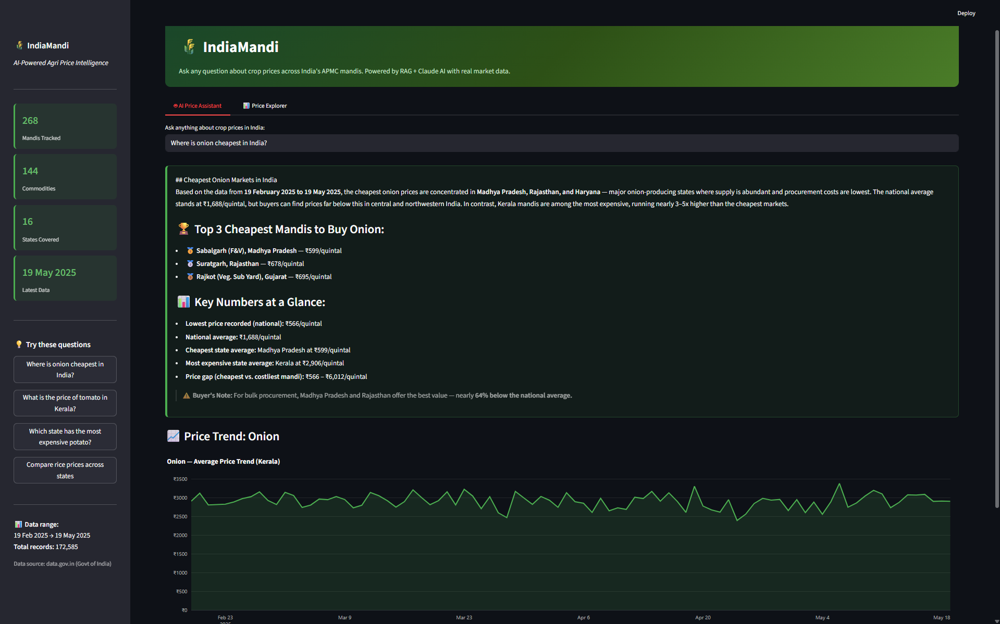
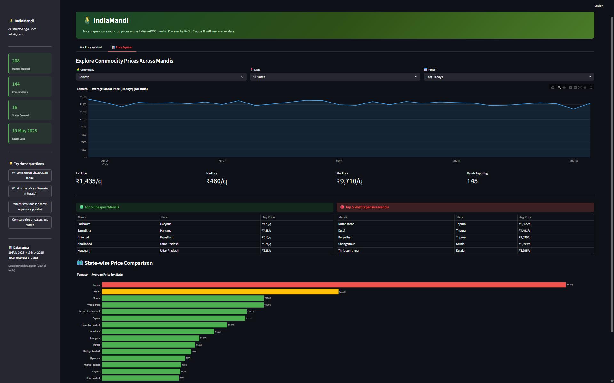

# 🌾 IndiaMandi — AI-Powered Agri Price Intelligence

> Ask plain-English questions about crop prices across India's 268+ APMC mandis. Get instant answers with real ₹ prices, mandi names, and trend charts — powered by RAG + Claude AI.



---

## What It Does

India has 6,000+ APMC mandis publishing daily prices for 300+ commodities. The data exists on government portals but is nearly impossible to query intelligently. IndiaMandi changes that.

**Type a question → Get a data-backed answer.**

- *"Where is onion cheapest in India?"* → Top 3 mandis with exact ₹/quintal prices
- *"What is the price of tomato in Kerala?"* → Mandi-wise breakdown with 7-day averages
- *"Which state has the most expensive potato?"* → State-wise comparison with price trends

The system retrieves relevant records from a vector database of 172,000+ price entries, then Claude AI synthesizes a precise answer citing actual data — no hallucination, no guessing.

---

## Screenshots

### AI Price Assistant
Ask any question in plain English. The RAG pipeline retrieves relevant mandi records from ChromaDB and Claude generates a data-driven answer with price trend charts.


### Price Explorer
Filter by commodity, state, and time period. Compare cheapest vs most expensive mandis with interactive Plotly charts and state-wise price comparison.



---

## Tech Stack

| Layer | Technology | Purpose |
|-------|-----------|---------|
| **Vector DB** | ChromaDB | Store & retrieve 172K+ price record embeddings |
| **Embeddings** | sentence-transformers (all-MiniLM-L6-v2) | Convert price records into 384-dim vectors — runs locally, no API needed |
| **AI Layer** | Anthropic Claude API (claude-sonnet-4-6) | Generate precise answers from retrieved data |
| **Web App** | Streamlit | Interactive dashboard with tabs, filters, and live stats |
| **Data Viz** | Plotly | Interactive price trend charts and state comparisons |
| **Data Processing** | Pandas, NumPy, PyArrow | Clean, transform, and engineer features from raw CSV |
| **Data Source** | data.gov.in (Govt of India) | Daily commodity prices from APMC mandis |
| **Language** | Python 3.10+ | End-to-end pipeline |

---

## How the RAG Pipeline Works

```
User Question
     │
     ▼
┌─────────────────┐
│ Embed question   │  ← SentenceTransformer (all-MiniLM-L6-v2)
│ into 384-dim     │
│ vector           │
└────────┬────────┘
         │
         ▼
┌─────────────────┐
│ Search ChromaDB  │  ← Cosine similarity search
│ for top 15       │     across 172K+ vectors
│ matching records │
└────────┬────────┘
         │
         ▼
┌─────────────────┐
│ Calculate extra  │  ← State averages, cheapest/
│ stats from       │     expensive mandis, trends
│ dataframe        │
└────────┬────────┘
         │
         ▼
┌─────────────────┐
│ Claude AI        │  ← System prompt enforces
│ generates answer │     data-only responses
│ with ₹ prices    │     (no hallucination)
└────────┬────────┘
         │
         ▼
   Answer + Chart
```

---

## Dataset

- **Source:** [data.gov.in](https://data.gov.in) — Daily Commodity Price & Arrivals (Mandi-wise)
- **Records:** 172,585 daily price entries
- **Period:** 19 Feb 2025 – 19 May 2025 (90 days)
- **Coverage:** 16 states, 268 mandis, 144 commodities
- **Fields:** State, District, Market, Commodity, Variety, Grade, Modal Price, Min/Max Price

### Engineered Features

| Feature | Description |
|---------|-------------|
| `price_7d_avg` | 7-day rolling average per commodity-mandi |
| `price_vs_state_avg` | % deviation from state average price |
| `commodity_slug` | Standardized commodity name for filtering |
| `week_of_year` | For seasonal pattern analysis |
| `month` | Monthly aggregation |

---

## EDA Insights

The [EDA notebook](notebooks/eda.ipynb) explores 5 key patterns in Indian commodity pricing:

| # | Insight | Finding |
|---|---------|---------|
| 1 | Price Variance | Ginger has 101% price variation across mandis — choosing the right mandi matters |
| 2 | Cheapest States | Madhya Pradesh is cheapest for Onion, Tomato, AND Potato. Kerala pays 3-10x more |
| 3 | Monthly Trends | Bhindi prices rise into summer; Tomato/Onion/Potato remain stable |
| 4 | Price Spread | Banana has the widest distribution (₹800–₹7,500/q) — biggest arbitrage opportunity |
| 5 | Market Dynamics | Kerala mandis are 40x more volatile than Haryana mandis for onion |

---

## Project Structure

```
indiamandi/
├── src/
│   ├── ingest.py      # Data download + cleaning + feature engineering
│   ├── embed.py       # Vector embedding pipeline (ChromaDB + SentenceTransformer)
│   ├── agent.py       # Claude AI agent with RAG retrieval
│   └── app.py         # Streamlit web application
├── data/
│   ├── raw/           # Downloaded CSVs from data.gov.in
│   └── clean/         # Processed Parquet files
├── notebooks/
│   ├── eda.ipynb      # Exploratory analysis — 5 key insights
│   └── charts/        # Generated EDA visualizations
├── screenshots/       # App screenshots for README
├── chroma_db/         # Persistent vector database (gitignored)
├── requirements.txt
└── README.md
```

---

## Run It Yourself

### Prerequisites
- Python 3.10+
- [Anthropic API key](https://console.anthropic.com/) (for Claude AI)

### Setup

```bash
# Clone the repo
git clone https://github.com/errorboy4O4/indiamandi.git
cd indiamandi

# Install dependencies
pip install -r requirements.txt

# Add your Anthropic API key
mkdir -p .streamlit
echo 'ANTHROPIC_API_KEY = "your-key-here"' > .streamlit/secrets.toml

# Step 1: Clean the data
python src/ingest.py

# Step 2: Build the vector database (takes 5-10 min)
python src/embed.py

# Step 3: Launch the app
streamlit run src/app.py
```

The app will open at `http://localhost:8501`.

---

## What Makes This Advanced

This project demonstrates a complete **RAG (Retrieval-Augmented Generation)** pipeline — a production-grade AI architecture used by companies like Notion, Stripe, and Databricks.

| Concept | Implementation |
|---------|---------------|
| **Vector Embeddings** | 172K+ text records → 384-dim vectors using SentenceTransformer |
| **Vector Database** | ChromaDB with persistent storage and cosine similarity search |
| **Retrieval-Augmented Generation** | Query embedding → vector search → context injection → LLM answer |
| **Data Engineering** | Raw CSV → cleaned Parquet with rolling averages, deviation metrics |
| **Prompt Engineering** | System prompt constrains Claude to data-only answers (no hallucination) |

---

## Built By

**Kaushik Gaur** — IITM Data Science, 3rd Year

- GitHub: [@errorboy4O4](https://github.com/errorboy4O4)

---

## License

This project uses open government data from [data.gov.in](https://data.gov.in) under India's Open Government Data License.